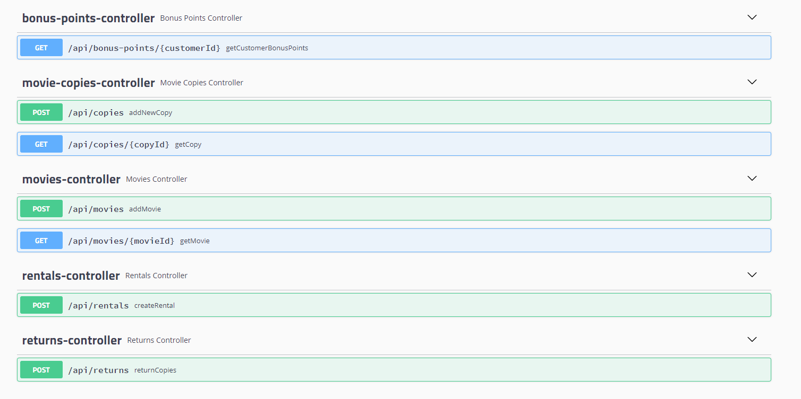

# Video Rental Store 

## Running the application

`./gradlew bootRun`

## Build executable jar

`./gradlew build`

### Run from jar

`java -jar video-rental-web-api/build/libs/video-rental-web-api-1.0-SNAPSHOT.jar`

### REST API

The implemented API supports the following operations:
 - adding movies
 - getting movie details
 - adding movie copies
 - getting movie copy details
 - renting copies
 - returning copies
 - getting customer bonus points

 
 
The details about the API can be found in Swagger. To access Swagger after running the application go to `http://localhost:8080/swagger-ui.html` 

## Decisions

The application has been designed to be "modular monolith" to achieve the consensus between simplicity and separation of concerns.
I believe the current design should allow for easy migration to microservices architecture if needed.

The following core modules have been identified:
 - `video-rental-pricing` - stateless module that just encapsulates the domain logic for rental price and delay charge calculations
 - `video-rental-inventory` - the module that has all the info about the movies and copies for each movie and their current statuses
 - `video-rental-rentals` - the module that manages the rentals and returns, uses inventory and pricing
 - `video-rental-bonuses` - the module that collect customer bonus points, listens for events generated by rentals
 
Two additional modules have been introduced to share the common infrastructure and expose the REST API:
 - `video-rental-common` - shared modules with abstractions for events, transactions and some shared data structures and functions
 - `video-rental-web-api` - REST API module, configures all the domain modules and exposes necessary endpoints for them, the only module that
 depends on an external framework (for others only libraries are used)

Due to limited time, a lot of assumptions have been made during the development.

The main ones include:
 - security has been skipped
 - infrastructure part has been skipped - only the inventory module uses database and flyway for migrations(but it is still the H2 in memory), other
 modules just use simple in memory implementations
 - event publishing and subscribing - the implementation is fully in memory and does not handle corner cases, also it is currently synchronous
 - prices currently are just numbers and does not handle currencies
 - error handling and dependencies between modules - for prod implementation all the important scenarios when multiple things can fail in
 different modules should be carefully analyzed and handled(for example inventory errors during rental)